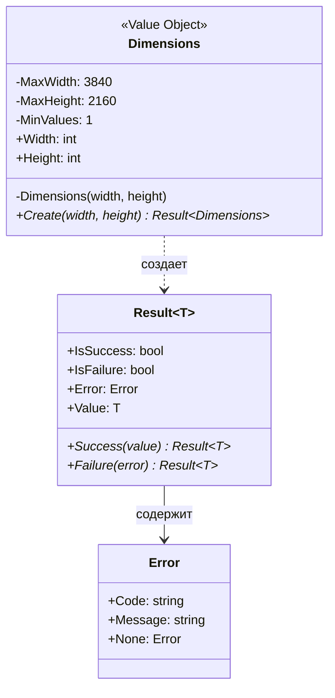

# Диаграмма классов Dimensions

```mermaid
classDiagram
    class Dimensions {
        <<Value Object>>
        -MaxWidth: 3840
        -MaxHeight: 2160
        -MinValues: 1
        +Width: int
        +Height: int
        -Dimensions(width, height)
        +Create(width, height)* Result~Dimensions~
    }
    
    class Result~T~ {
        +IsSuccess: bool
        +IsFailure: bool
        +Error: Error
        +Value: T
        +Success(value)* Result~T~
        +Failure(error)* Result~T~
    }
    
    class Error {
        +Code: string
        +Message: string
        +None: Error
    }
    
    Dimensions ..> Result~Dimensions~ : создает
    Result~Dimensions~ --> Error : содержит
```