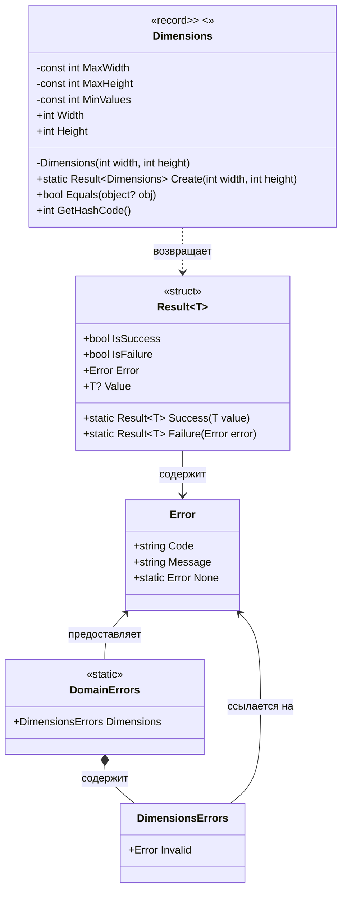

# Диаграмма классов 

```mermaid
classDiagram
    class Result~T~ {
        <<struct>>
        +bool IsSuccess
        +bool IsFailure
        +Error Error
        +T? Value
        +static Result~T~ Success(T value)
        +static Result~T~ Failure(Error error)
    }

    class Error {
        +string Code
        +string Message
        +static Error None
    }

    class DomainErrors {
        <<static>>
        +DimensionsErrors Dimensions
    }

    class DimensionsErrors {
        +Error Invalid
    }

    class Dimensions {
        <<record>> <<Value Object>>
        -const int MaxWidth
        -const int MaxHeight
        -const int MinValues
        +int Width
        +int Height
        -Dimensions(int width, int height)
        +static Result~Dimensions~ Create(int width, int height)
        +bool Equals(object? obj)
        +int GetHashCode()
    }

    Dimensions ..> Result~Dimensions~ : возвращает
    Result~Dimensions~ --> Error : содержит
    Error <-- DomainErrors : предоставляет
    DomainErrors *-- DimensionsErrors : содержит
    DimensionsErrors --> Error : ссылается на
```