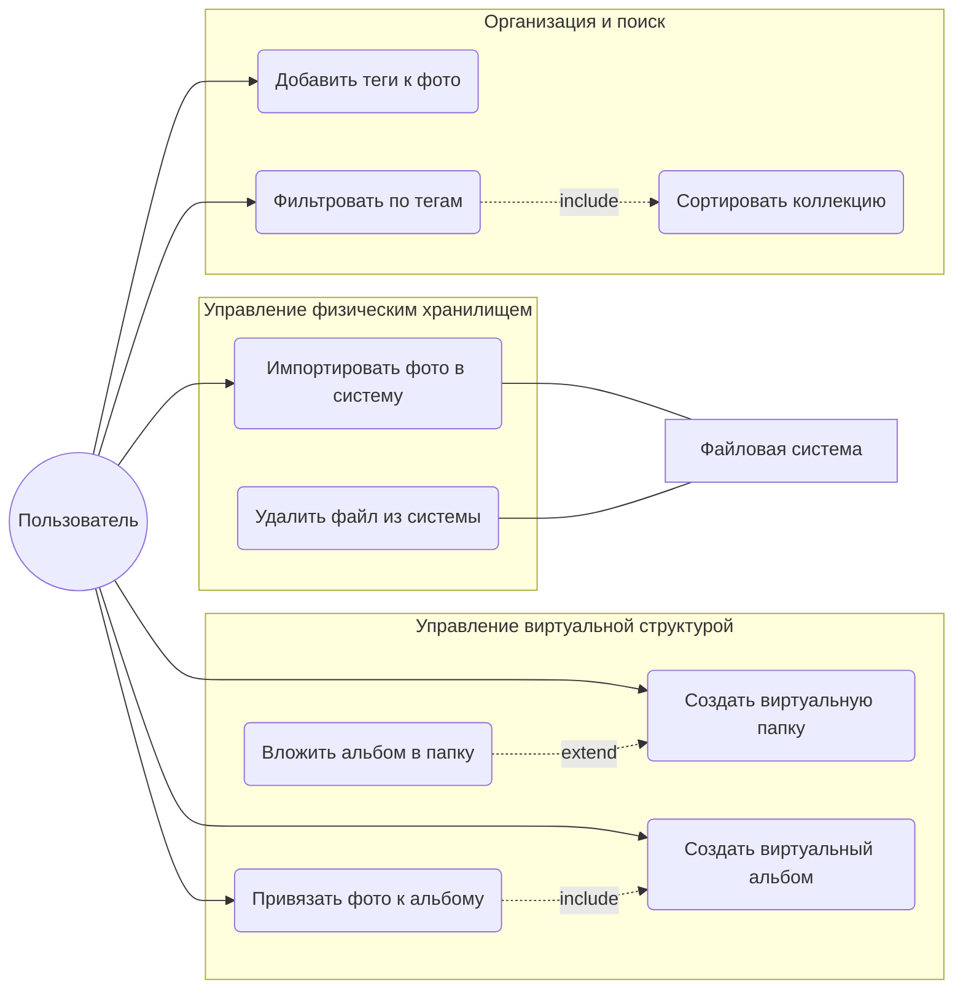
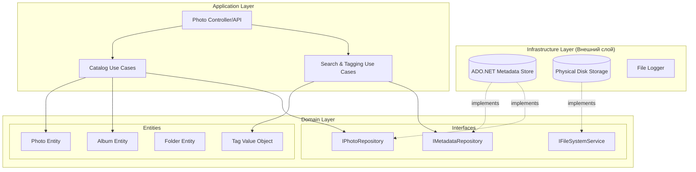

# Диаграмма прецендентов

```mermaid
graph LR
    User((Пользователь))
    FS[Файловая система]

    subgraph "Управление физическим хранилищем"
        UC_Import(Импортировать фото в систему)
        UC_PhysDel(Удалить файл из cистемы)
    end

    subgraph "Управление виртуальной структурой"
        UC_CreateFolder(Создать виртуальную папку)
        UC_CreateAlbum(Создать виртуальный альбом)
        UC_Nest(Вложить альбом в папку)
        UC_Link(Привязать фото к альбому)
    end

    subgraph "Организация и поиск"
        UC_Tag(Добавить теги к фото)
        UC_Sort(Сортировать коллекцию)
        UC_Filter(Фильтровать по тегам)
    end

    %% Связи пользователя с прецедентами
    User --> UC_Import
    User --> UC_CreateFolder
    User --> UC_CreateAlbum
    User --> UC_Link
    User --> UC_Tag
    User --> UC_Filter

    %% Внутренние зависимости (Include/Extend)
    UC_Link -.->|include| UC_CreateAlbum
    UC_Nest -.->|extend| UC_CreateFolder
    UC_Filter -.->|include| UC_Sort

    %% Взаимодействие с системой
    UC_Import --- FS
    UC_PhysDel --- FS
```

# Диаграмма компонентов

```mermaid 
graph TD
    subgraph "Infrastructure Layer (Внешний слой)"
        DB[(ADO.NET Metadata Store)]
        FS[(Physical Disk Storage)]
        Logger[File Logger]
    end

    subgraph "Application Layer"
        direction TB
        PC[Photo Controller/API]
        UC_Manage[Catalog Use Cases]
        UC_Search[Search & Tagging Use Cases]
    end

    subgraph "Domain Layer"
        direction TB
        
        subgraph "Entities"
            E_Photo[Photo Entity]
            E_Album[Album Entity]
            E_Folder[Folder Entity]
            E_Tag[Tag Value Object]
        end
        
        subgraph "Interfaces"
            I_PhotoRepo[IPhotoRepository]
            I_MetaRepo[IMetadataRepository]
            I_FileServer[IFileSystemService]
        end
    end


    PC --> UC_Manage
    PC --> UC_Search
    
    UC_Manage --> E_Photo
    UC_Manage --> E_Album
    UC_Manage --> I_PhotoRepo
    
    UC_Search --> E_Tag
    UC_Search --> I_MetaRepo


    DB -.->|implements| I_MetaRepo
    FS -.->|implements| I_FileServer
    DB -.->|implements| I_PhotoRepo
```

