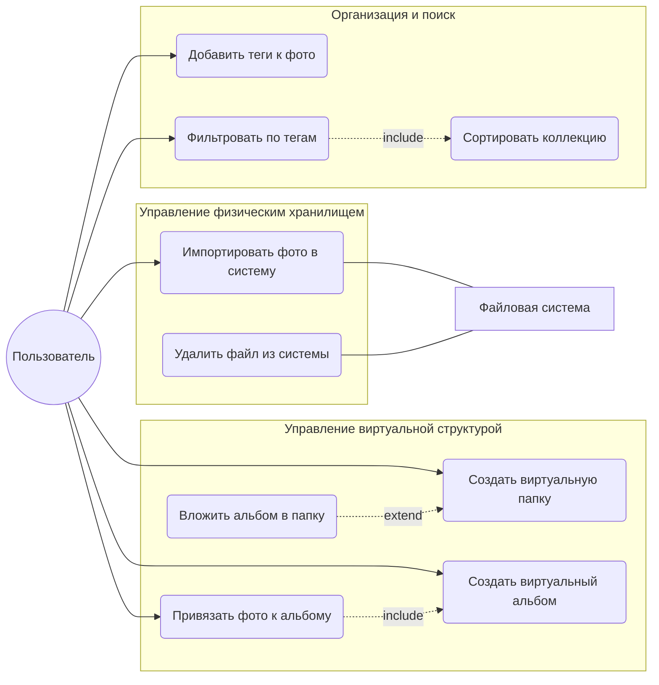
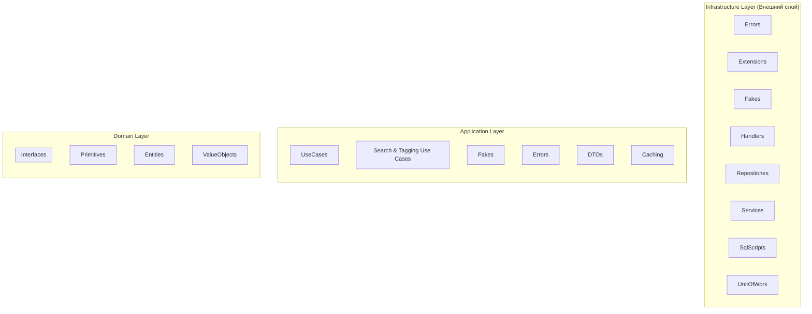

* [Конвенции и правила проекта](docs/rules/Сonvention.md)
* [Техническая спецификация проекта](docs/docfx/docs/TechnicalSpecification.md)

# Диаграмма прецендентов

# Диаграмма компонентов

У наc не доделан Search & Tagging Use Cases

# Технологический стек проекта

Данный проект базируется на стеке технологий .NET.

## Основная платформа
*   **Язык программирования:** C# 13
*   **Runtime:** .NET 10

## База данных и ORM
*   **СУБД:** SQLite — легковесная встраиваемая реляционная база данных.
*   **ORM:** Dapper — используется для маппинга доменных моделей на таблицы БД.

## Тестирование
*   **Unit-тестирование:** xUnit — основной фреймворк для написания и запуска автоматических тестов.
*   **Архитектурные тесты:** ArchUnitNET — используется для контроля соблюдения правил архитектуры.

## Логирование и диагностика
*   **Логгирование:** Serilog — библиотека для структурированного логирования. Позволяет сохранять события не просто как текст, а в виде структурированных данных, что упрощает отладку и мониторинг состояния системы.
