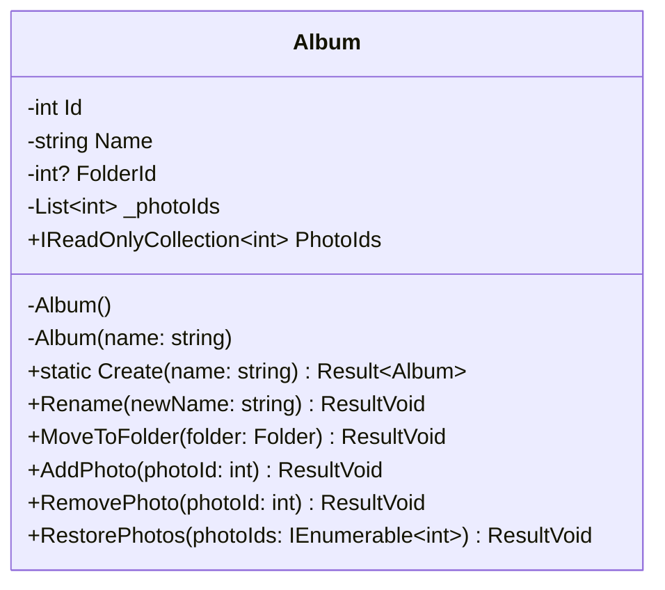

```mermaid
classDiagram
    class Album {
        -int Id
        -string Name
        -int? FolderId
        -List~int~ _photoIds
        +IReadOnlyCollection~int~ PhotoIds
        -Album()
        -Album(name: string)
        +static Create(name: string) Result~Album~
        +Rename(newName: string) ResultVoid
        +MoveToFolder(folder: Folder) ResultVoid
        +AddPhoto(photoId: int) ResultVoid
        +RemovePhoto(photoId: int) ResultVoid
        +RestorePhotos(photoIds: IEnumerable~int~) ResultVoid
    }
```