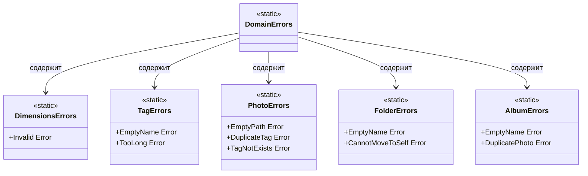

```mermaid
classDiagram
    class DomainErrors {
        <<static>>
    }

    class DimensionsErrors {
        <<static>>
        +Invalid Error
    }

    class TagErrors {
        <<static>>
        +EmptyName Error
        +TooLong Error
    }

    class PhotoErrors {
        <<static>>
        +EmptyPath Error
        +DuplicateTag Error
        +TagNotExists Error
    }

    class FolderErrors {
        <<static>>
        +EmptyName Error
        +CannotMoveToSelf Error
    }

    class AlbumErrors {
        <<static>>
        +EmptyName Error
        +DuplicatePhoto Error
    }
    
    DomainErrors --> DimensionsErrors : содержит
    DomainErrors --> TagErrors : содержит
    DomainErrors --> PhotoErrors : содержит
    DomainErrors --> FolderErrors : содержит
    DomainErrors --> AlbumErrors : содержит

```