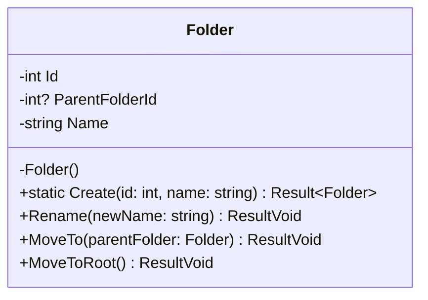

```mermaid
classDiagram
    class Folder {
        -int Id
        -int? ParentFolderId
        -string Name
        -Folder()
        +static Create(id: int, name: string) Result~Folder~
        +Rename(newName: string) ResultVoid
        +MoveTo(parentFolder: Folder) ResultVoid
        +MoveToRoot() ResultVoid
    }
```