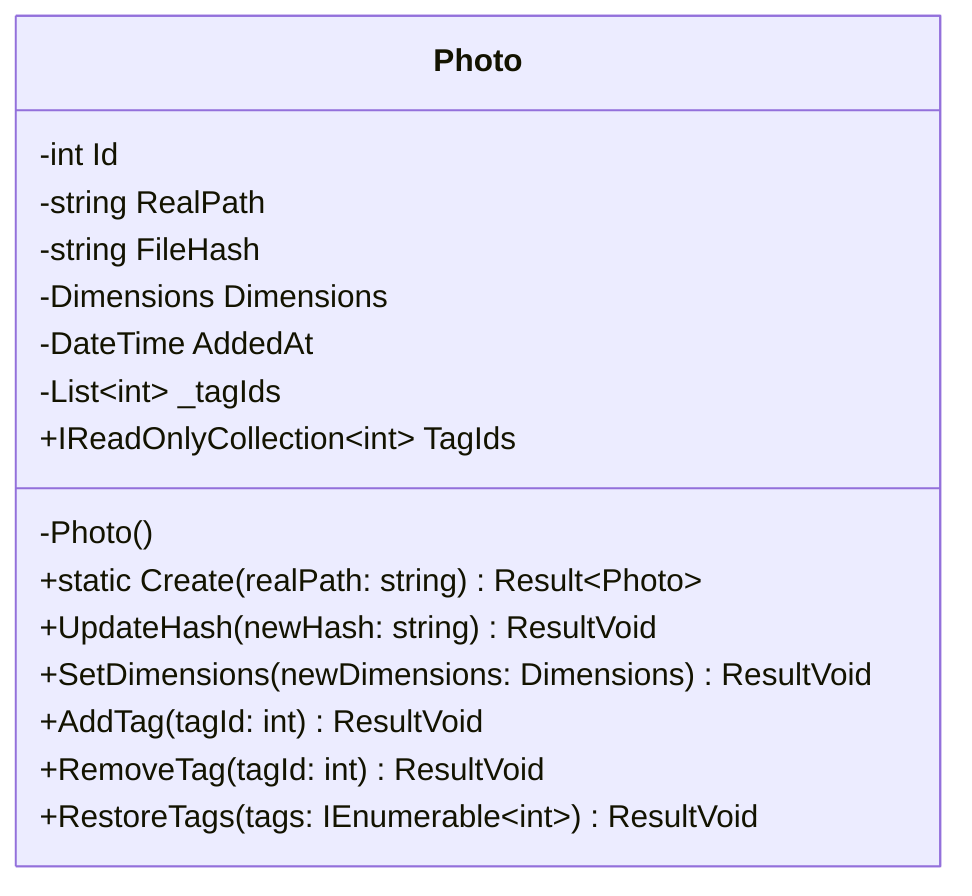

```mermaid
classDiagram
    class Photo {
        -int Id
        -string RealPath
        -string FileHash
        -Dimensions Dimensions
        -DateTime AddedAt
        -List~int~ _tagIds
        +IReadOnlyCollection~int~ TagIds
        -Photo()
        +static Create(realPath: string) Result~Photo~
        +UpdateHash(newHash: string) ResultVoid
        +SetDimensions(newDimensions: Dimensions) ResultVoid
        +AddTag(tagId: int) ResultVoid
        +RemoveTag(tagId: int) ResultVoid
        +RestoreTags(tags: IEnumerable~int~) ResultVoid
    }
```