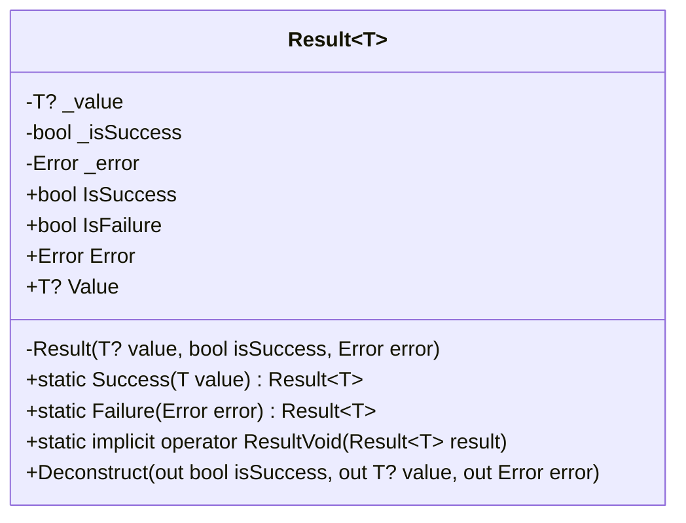

```mermaid
classDiagram
    class Result~T~ {
        -T? _value
        -bool _isSuccess
        -Error _error
        +bool IsSuccess
        +bool IsFailure
        +Error Error
        +T? Value
        -Result(T? value, bool isSuccess, Error error)
        +static Success(T value) Result~T~
        +static Failure(Error error) Result~T~
        +static implicit operator ResultVoid(Result~T~ result)
        +Deconstruct(out bool isSuccess, out T? value, out Error error)
    }
```