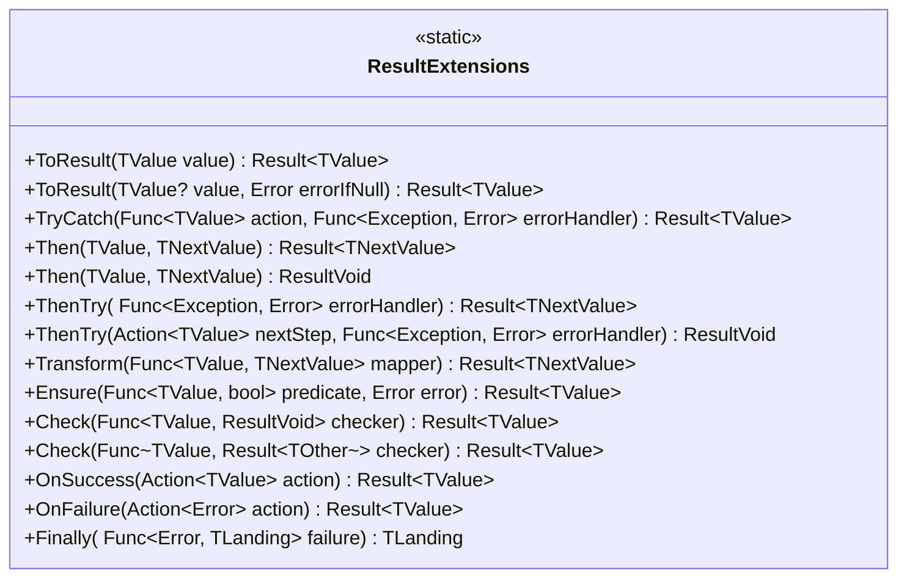

```mermaid
classDiagram
    class ResultExtensions {
        <<static>>
        +ToResult(TValue value) Result~TValue~
        +ToResult(TValue? value, Error errorIfNull) Result~TValue~
        +TryCatch(Func~TValue~ action, Func~Exception, Error~ errorHandler) Result~TValue~
        +Then(TValue, TNextValue) Result~TNextValue~
        +Then(TValue, TNextValue) ResultVoid
        +ThenTry(Func~TValue, TNextValue~ nextStep, Func~Exception, Error~ errorHandler) Result~TNextValue~
        +ThenTry(Action~TValue~ nextStep, Func~Exception, Error~ errorHandler) ResultVoid
        +Transform(Func~TValue, TNextValue~ mapper) Result~TNextValue~
        +Ensure(Func~TValue, bool~ predicate, Error error) Result~TValue~
        +Check(Func~TValue, ResultVoid~ checker) Result~TValue~
        +Check(Func~TValue, Result~TOther~~ checker) Result~TValue~
        +OnSuccess(Action~TValue~ action) Result~TValue~
        +OnFailure(Action~Error~ action) Result~TValue~
        +Finally(Func~TValue, TLanding~ success, Func~Error, TLanding~ failure) TLanding
    }
```