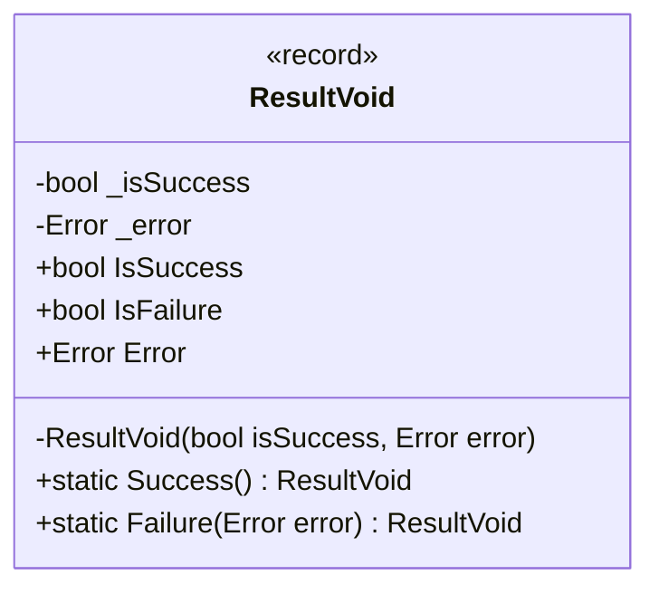

```mermaid
classDiagram
    class ResultVoid {
        <<record>>
        -bool _isSuccess
        -Error _error
        +bool IsSuccess
        +bool IsFailure
        +Error Error
        -ResultVoid(bool isSuccess, Error error)
        +static Success() ResultVoid
        +static Failure(Error error) ResultVoid
    }
```