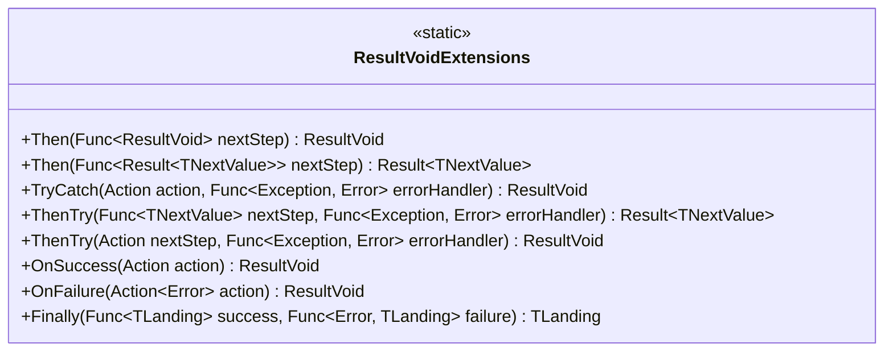

```mermaid
classDiagram
    class ResultVoidExtensions {
        <<static>>
        +Then(Func~ResultVoid~ nextStep) ResultVoid
        +Then(Func~Result~TNextValue~~ nextStep) Result~TNextValue~
        +TryCatch(Action action, Func~Exception, Error~ errorHandler) ResultVoid
        +ThenTry(Func~TNextValue~ nextStep, Func~Exception, Error~ errorHandler) Result~TNextValue~
        +ThenTry(Action nextStep, Func~Exception, Error~ errorHandler) ResultVoid
        +OnSuccess(Action action) ResultVoid
        +OnFailure(Action~Error~ action) ResultVoid
        +Finally(Func~TLanding~ success, Func~Error, TLanding~ failure) TLanding
    }
```