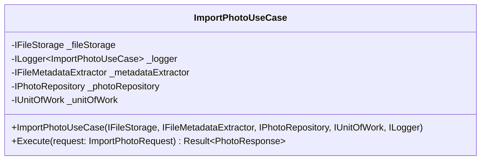

```mermaid
classDiagram
    class ImportPhotoUseCase {
        -IFileStorage _fileStorage
        -ILogger~ImportPhotoUseCase~ _logger
        -IFileMetadataExtractor _metadataExtractor
        -IPhotoRepository _photoRepository
        -IUnitOfWork _unitOfWork
        +ImportPhotoUseCase(IFileStorage, IFileMetadataExtractor, IPhotoRepository, IUnitOfWork, ILogger)
        +Execute(request: ImportPhotoRequest) Result~PhotoResponse~
    }
```