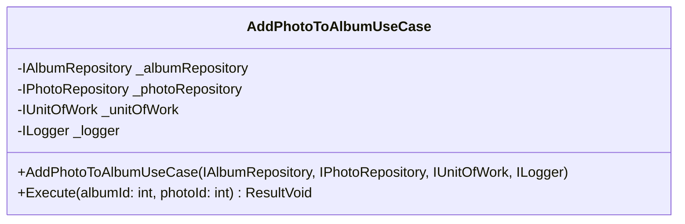

```mermaid
classDiagram
    class AddPhotoToAlbumUseCase {
        -IAlbumRepository _albumRepository
        -IPhotoRepository _photoRepository
        -IUnitOfWork _unitOfWork
        -ILogger _logger
        +AddPhotoToAlbumUseCase(IAlbumRepository, IPhotoRepository, IUnitOfWork, ILogger)
        +Execute(albumId: int, photoId: int) ResultVoid
    }
```