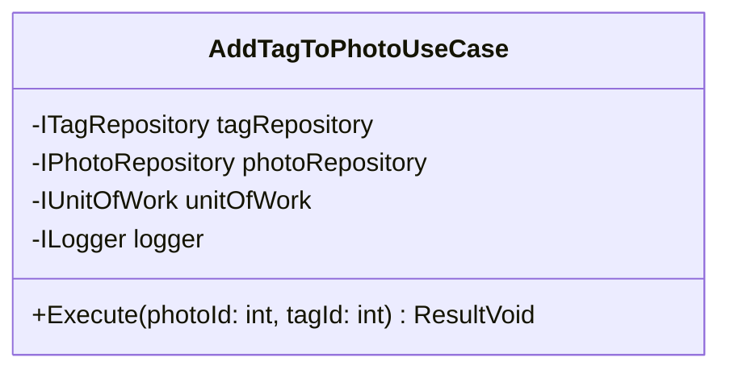

```mermaid
classDiagram
    class AddTagToPhotoUseCase {
        -ITagRepository tagRepository
        -IPhotoRepository photoRepository
        -IUnitOfWork unitOfWork
        -ILogger logger
        +Execute(photoId: int, tagId: int) ResultVoid
    }
```