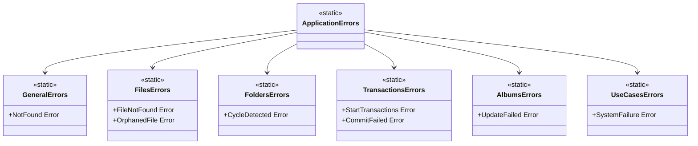

```mermaid
classDiagram
    class ApplicationErrors {
        <<static>>
    }

    class GeneralErrors {
        <<static>>
        +NotFound Error
    }

    class FilesErrors {
        <<static>>
        +FileNotFound Error
        +OrphanedFile Error
    }

    class FoldersErrors {
        <<static>>
        +CycleDetected Error
    }

    class TransactionsErrors {
        <<static>>
        +StartTransactions Error
        +CommitFailed Error
    }

    class AlbumsErrors {
        <<static>>
        +UpdateFailed Error
    }

    class UseCasesErrors {
        <<static>>
        +SystemFailure Error
    }
    
    ApplicationErrors --> GeneralErrors
    ApplicationErrors --> FilesErrors
    ApplicationErrors --> FoldersErrors
    ApplicationErrors --> TransactionsErrors
    ApplicationErrors --> AlbumsErrors
    ApplicationErrors --> UseCasesErrors
```