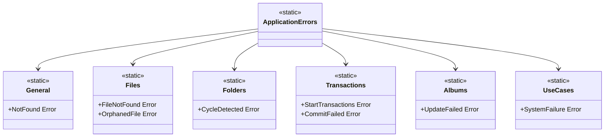

```mermaid
classDiagram
    class ApplicationErrors {
        <<static>>
    }

    class General {
        <<static>>
        +NotFound Error
    }

    class Files {
        <<static>>
        +FileNotFound Error
        +OrphanedFile Error
    }

    class Folders {
        <<static>>
        +CycleDetected Error
    }

    class Transactions {
        <<static>>
        +StartTransactions Error
        +CommitFailed Error
    }

    class Albums {
        <<static>>
        +UpdateFailed Error
    }

    class UseCases {
        <<static>>
        +SystemFailure Error
    }
    
    ApplicationErrors --> General
    ApplicationErrors --> Files
    ApplicationErrors --> Folders
    ApplicationErrors --> Transactions
    ApplicationErrors --> Albums
    ApplicationErrors --> UseCases
```
