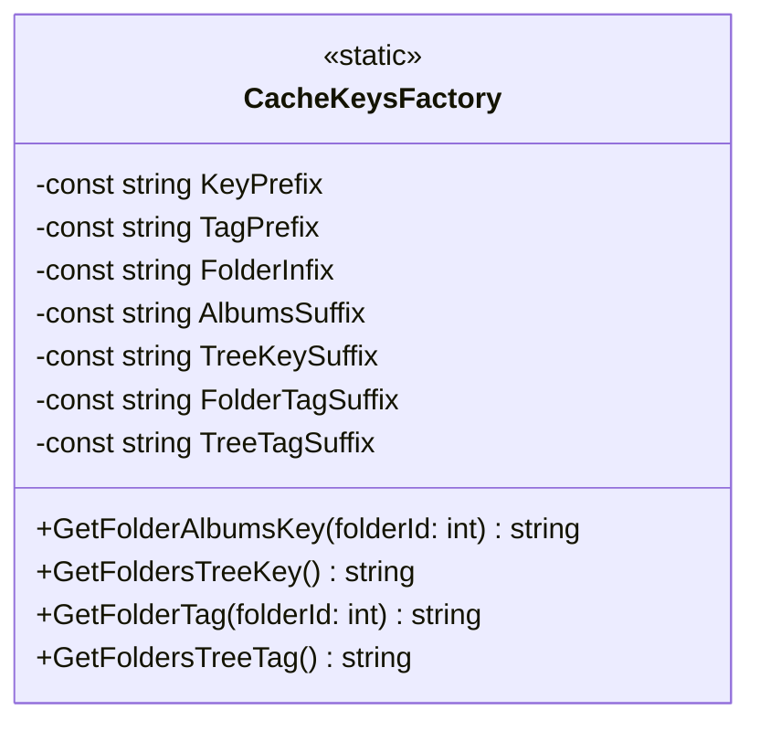

```mermaid
classDiagram
    class CacheKeysFactory {
        <<static>>
        -const string KeyPrefix
        -const string TagPrefix
        -const string FolderInfix
        -const string AlbumsSuffix
        -const string TreeKeySuffix
        -const string FolderTagSuffix
        -const string TreeTagSuffix
        +GetFolderAlbumsKey(folderId: int) string
        +GetFoldersTreeKey() string
        +GetFolderTag(folderId: int) string
        +GetFoldersTreeTag() string
    }
```