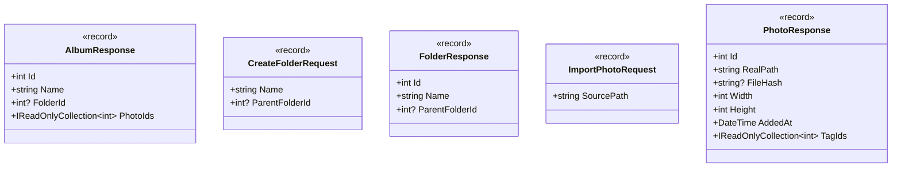

```mermaid
classDiagram
    class AlbumResponse {
        <<record>>
        +int Id
        +string Name
        +int? FolderId
        +IReadOnlyCollection~int~ PhotoIds
    }

    class CreateFolderRequest {
        <<record>>
        +string Name
        +int? ParentFolderId
    }

    class FolderResponse {
        <<record>>
        +int Id
        +string Name
        +int? ParentFolderId
    }

    class ImportPhotoRequest {
        <<record>>
        +string SourcePath
    }

    class PhotoResponse {
        <<record>>
        +int Id
        +string RealPath
        +string? FileHash
        +int Width
        +int Height
        +DateTime AddedAt
        +IReadOnlyCollection~int~ TagIds
    }
```