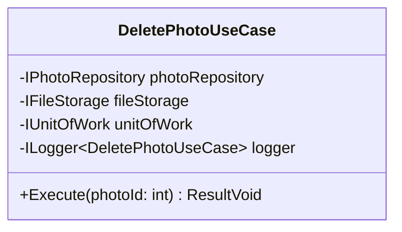

```mermaid
classDiagram
    class DeletePhotoUseCase {
        -IPhotoRepository photoRepository
        -IFileStorage fileStorage
        -IUnitOfWork unitOfWork
        -ILogger~DeletePhotoUseCase~ logger
        +Execute(photoId: int) ResultVoid
    }
```