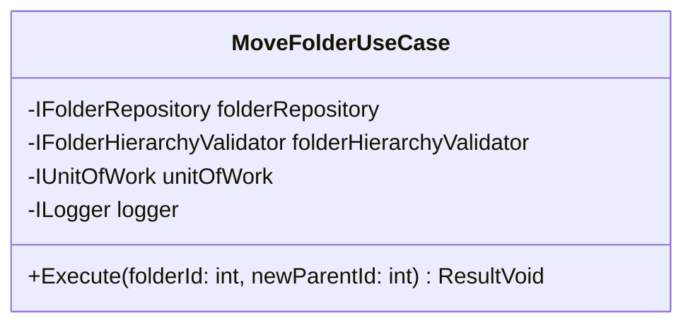

```mermaid
classDiagram
    class MoveFolderUseCase {
        -IFolderRepository folderRepository
        -IFolderHierarchyValidator folderHierarchyValidator
        -IUnitOfWork unitOfWork
        -ILogger logger
        +Execute(folderId: int, newParentId: int) ResultVoid
    }
```