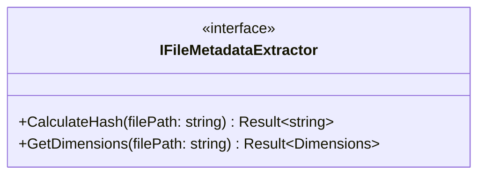

```mermaid
classDiagram
    class IFileMetadataExtractor {
        <<interface>>
        +CalculateHash(filePath: string) Result~string~
        +GetDimensions(filePath: string) Result~Dimensions~
    }
```
