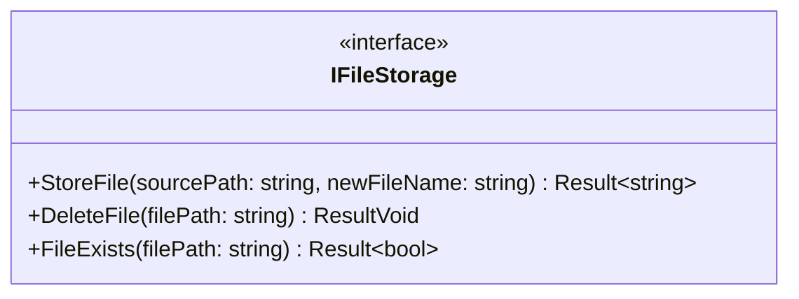

```mermaid
classDiagram
    class IFileStorage {
    <<interface>>
        +StoreFile(sourcePath: string, newFileName: string) Result~string~
        +DeleteFile(filePath: string) ResultVoid
        +FileExists(filePath: string) Result~bool~
    }
```
