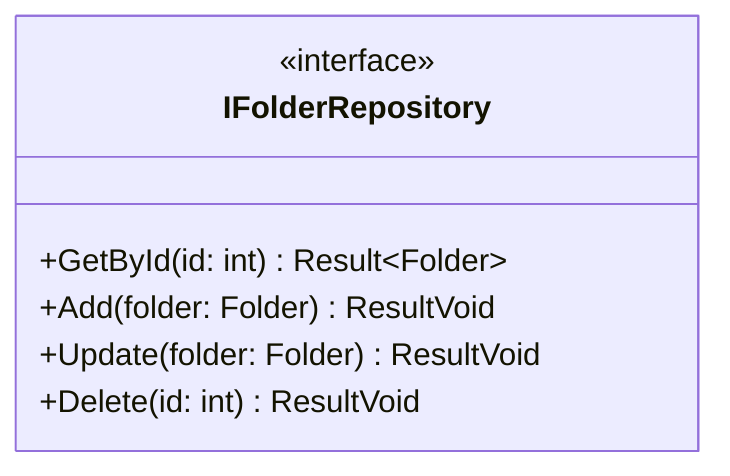

```mermaid
classDiagram
    class IFolderRepository {
<<interface>> 
        +GetById(id: int) Result~Folder~
        +Add(folder: Folder) ResultVoid
        +Update(folder: Folder) ResultVoid
        +Delete(id: int) ResultVoid
    }
```
