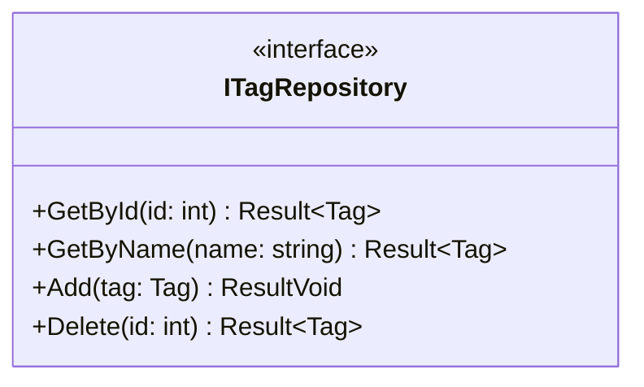

```mermaid
classDiagram
    class ITagRepository {
<<interface>> 
        +GetById(id: int) Result~Tag~
        +GetByName(name: string) Result~Tag~
        +Add(tag: Tag) ResultVoid
        +Delete(id: int) Result~Tag~
    }
```
