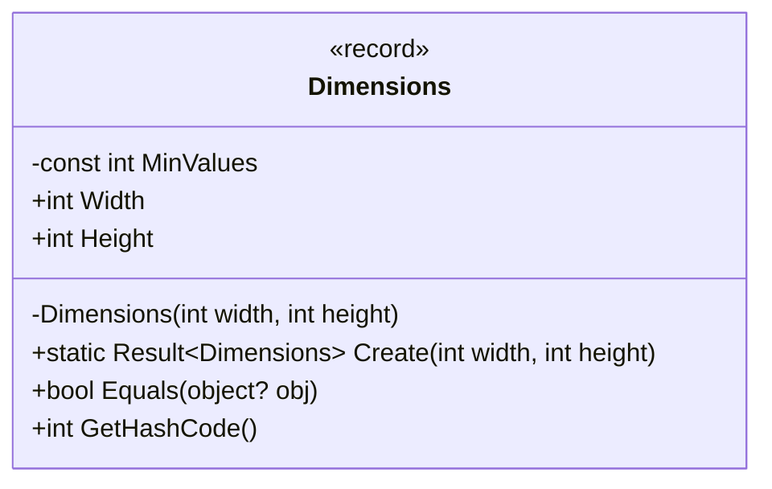

```mermaid
classDiagram
    class Dimensions {
        <<record>>
        -const int MinValues
        +int Width
        +int Height
        -Dimensions(int width, int height)
        +static Result~Dimensions~ Create(int width, int height)
        +bool Equals(object? obj)
        +int GetHashCode()
    }
```
