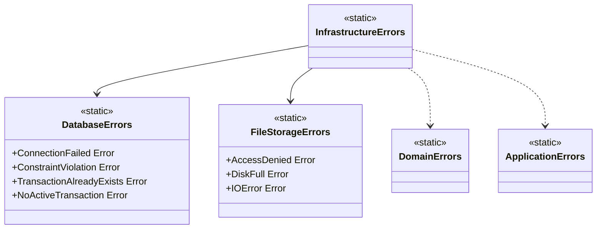

```mermaid
classDiagram
    class InfrastructureErrors {
        <<static>>
    }

    class DatabaseErrors {
        <<static>>
        +ConnectionFailed Error
        +ConstraintViolation Error
        +TransactionAlreadyExists Error
        +NoActiveTransaction Error
    }

    class FileStorageErrors {
        <<static>>
        +AccessDenied Error
        +DiskFull Error
        +IOError Error
    }

    class DomainErrors {
        <<static>>
    }

    class ApplicationErrors {
        <<static>>
    }

    InfrastructureErrors --> DatabaseErrors
    InfrastructureErrors --> FileStorageErrors
    
    InfrastructureErrors ..> DomainErrors 
    InfrastructureErrors ..> ApplicationErrors 
```