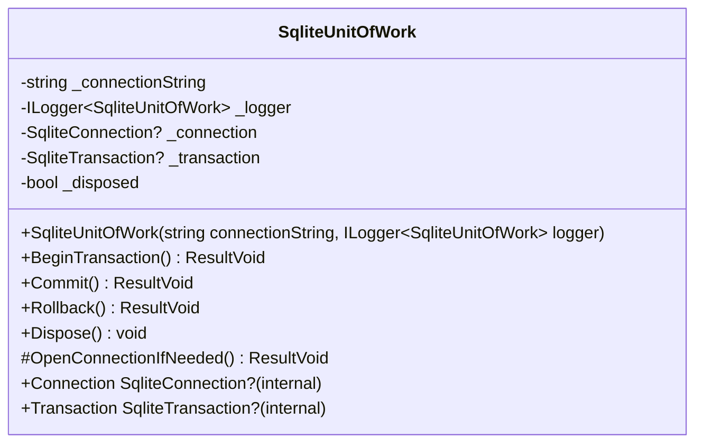

```mermaid
classDiagram
    class SqliteUnitOfWork {
        -string _connectionString
        -ILogger~SqliteUnitOfWork~ _logger
        -SqliteConnection? _connection
        -SqliteTransaction? _transaction
        -bool _disposed
        +SqliteUnitOfWork(string connectionString, ILogger~SqliteUnitOfWork~ logger)
        +BeginTransaction() ResultVoid
        +Commit() ResultVoid
        +Rollback() ResultVoid
        +Dispose() void
        #OpenConnectionIfNeeded() ResultVoid
        +Connection SqliteConnection? (internal)
        +Transaction SqliteTransaction? (internal)
    }
```