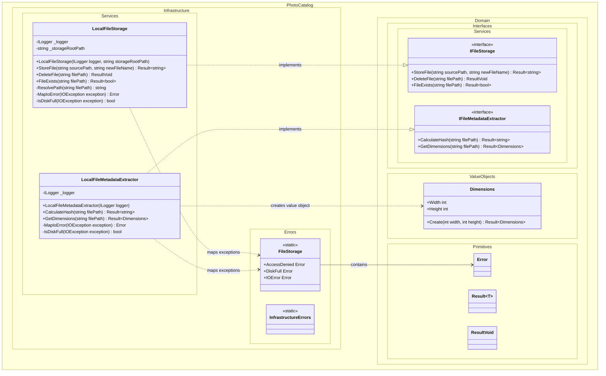

# Local File Infrastructure Services

```mermaid
classDiagram
namespace PhotoCatalog.Domain.Interfaces.Services {
    class IFileStorage {
        <<interface>>
        +StoreFile(string sourcePath, string newFileName) Result~string~
        +DeleteFile(string filePath) ResultVoid
        +FileExists(string filePath) Result~bool~
    }

    class IFileMetadataExtractor {
        <<interface>>
        +CalculateHash(string filePath) Result~string~
        +GetDimensions(string filePath) Result~Dimensions~
    }
}

namespace PhotoCatalog.Infrastructure.Services {
    class LocalFileStorage {
        -ILogger _logger
        -string _storageRootPath
        +LocalFileStorage(ILogger logger, string storageRootPath)
        +StoreFile(string sourcePath, string newFileName) Result~string~
        +DeleteFile(string filePath) ResultVoid
        +FileExists(string filePath) Result~bool~
        -ResolvePath(string filePath) string
        -MapIoError(IOException exception) Error
        -IsDiskFull(IOException exception) bool
    }

    class LocalFileMetadataExtractor {
        -ILogger _logger
        +LocalFileMetadataExtractor(ILogger logger)
        +CalculateHash(string filePath) Result~string~
        +GetDimensions(string filePath) Result~Dimensions~
        -MapIoError(IOException exception) Error
        -IsDiskFull(IOException exception) bool
    }
}

namespace PhotoCatalog.Infrastructure.Errors {
    class InfrastructureErrors {
        <<static>>
    }

    class FileStorage {
        <<static>>
        +AccessDenied Error
        +DiskFull Error
        +IOError Error
    }
}

namespace PhotoCatalog.Domain.Primitives {
    class Result~T~
    class ResultVoid
    class Error
}

namespace PhotoCatalog.Domain.ValueObjects {
    class Dimensions {
        +Width int
        +Height int
        +Create(int width, int height) Result~Dimensions~
    }
}

LocalFileStorage ..|> IFileStorage : implements
LocalFileMetadataExtractor ..|> IFileMetadataExtractor : implements
LocalFileStorage ..> FileStorage : maps exceptions
LocalFileMetadataExtractor ..> FileStorage : maps exceptions
LocalFileMetadataExtractor ..> Dimensions : creates value object
FileStorage --> Error : contains
```
