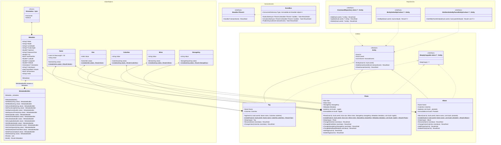

# Диаграмма классов доменного слоя

```mermaid
classDiagram
namespace ValueObjects {
    class Name {
        +const int MaxLength = 50
        +string Value
        -Name(string value)
        +Create(string value) Result~Name~$
    }

    class ColorHex {
        +string Value
        -ColorHex(string value)
        +Create(srting value) Result~ColorHex~$
    }

    class Orientation["Orientation : byte"] {
        <<Enum>>
        +Horizontal
        +Vertical
    }

    class Metadata {
        +string? Make
        +string? Model
        +string? LensModel
        +string? FocalLength
        +double? Aperture
        +string? ExposureTime
        +double? Iso
        +bool? HasFlashfire
        +double? Latitude
        +double? Longitude
        +double? Altitude
        +Orientation? Orientation
        +string? ColorSpace
        +DateTimeOffset? ShotAt
        +bool? IsPanorama
        +string? Artist
        -Metadata()
    }

    class MetadataBuilder {
        -Metadata _metadata
        +MetadataBuilder()
        +SetMake(string value) MetadataBuilder
        +SetModel(string value) MetadataBuilder
        +SetLensModel(string value) MetadataBuilder
        +SetFocalLength(string value) MetadataBuilder
        +SetAperture(double value) MetadataBuilder
        +SetExposureTime(string value) MetadataBuilder
        +SetIso(double value) MetadataBuilder
        +SetHasFlashfire(bool value) MetadataBuilder
        +SetLatitude(double value) MetadataBuilder
        +SetLongitude(double value) MetadataBuilder
        +SetAltitude(double value) MetadataBuilder
        +SetOrientation(Orientation value) MetadataBuilder
        +SetColorSpace(string value) MetadataBuilder
        +SetShotAt(DateTimeOffset value) MetadataBuilder
        +SetIsPanorama(bool value) MetadataBuilder
        +SetArtist(string value) MetadataBuilder
        +Reset() void
        +Build() Result~Metadata~
    }

    class Size {
        +Int64 Value
        -Size(Int64 value)
        +Create(Int64 value) Result~Size~$
    }

    class Mime {
        +string Value
        -Mime(srting value)
        +Create(string value) Result~Mime~$
    }

    class StorageKey {
        +string Value
        -StorageKey(string value)
        +Create(string value) Result~StorageKey~$
    }
}
Orientation <--* Metadata
Metadata <--* MetadataBuilder : MetadataBuilder вложен в Metadata

namespace Entities {
    class Entity {
        <<Abstract>>
        #Guid Id
        #Guid UserId
        #List~IEvent~ DomainEvents
        #Entity(Guid id, Guid userId)
        #AddDomainEvent(IEvent domainEvent) ResultVoid
        #ClearDomainEvents() ResultVoid
    }

    class IDeeplyCopyable["IDeeplyCopyable where T : Entity"] {
        <<Interface>>
        DeepCopy() T
    }

    class Tag {
        +Name Name
        +ColorHex ColorHex
        -Tag(Guid id, Guid userId, Name name, ColorHex colorHex)
        +Create(Guid id, Guid userId, Name name, ColorHex colorHex) Result~Tag~$
        +DeepCopy() Tag
        +Rename(Name newValue) ResultVoid
        +ChangeColor(ColorHex newValue) ResultVoid
    }

    class Photo{
        +Size Size
        +Mime Mime
        +StorageKey StorageKey
        +Metadata Metadata
        -readonly List~Guid~ _tagIds
        +IImmutableList~Guid~ TagIds
        -Photo(Guid id, Guid userId, Size size, Mime mime, StorageKey storageKey, Metadata metadata, List~Guid~ tagIds)
        +Create(Guid id, Guid userId, Size size, Mime mime, StorageKey storageKey, Metadata metadata, List~Guid~ tagIds) Result~Photo~$
        +DeepCopy() Photo
        +ChangeSize(Size newValue) ResultVoid
        +ChangeMime(Mime newValue) ResultVoid
        +ChangeStorageKey(StorageKey newValue) ResultVoid
        +ChangeMetadata(Metadata newValue) ResultVoid
        +AddTag(Guid id) ResultVoid
        +DeleteTag(Guid id) ResultVoid
    }

    class Album{
        +Name Name
        +ColorHex ColorHex
        -readonly List~Guid~ _photoIds
        +IImmutableList~Guid~ PhotoIds
        -Album(Guid id, Guid userId, Name name, List~Guid~ photoIds)
        +Create(Guid id, Guid userId, Name name, List~Guid~ photoIds) Result~Album~$
        +DeepCopy() Album
        +Rename(Name newValue) ResultVoid
        +ChangeColor(ColorHex newValue) ResultVoid
        +AddPhoto(Guid id) ResultVoid
        +DeletePhoto(Guid id) ResultVoid
    }
}
Entity <|-- Tag
IDeeplyCopyable <|.. Tag
Name <--* Tag
ColorHex <--* Tag
Entity <|-- Photo
IDeeplyCopyable <|.. Photo
Metadata <--* Photo
Size <--* Photo
Mime <--* Photo
StorageKey <--* Photo
Entity <|-- Album
IDeeplyCopyable <|.. Album
Name <--* Album
ColorHex <--* Album


namespace Repositories {
    class ICommandRepository["ICommandRepository where T : Entity"] {
        <<Interface>>
        +Add(Guid userId, T entity) ResultVoid
        +Update(Guid userId, T entity) ResultVoid
        +Delete(Guid userId, T entity) ResultVoid
    }

    class IEntityGetterById["IEntityGetterById where T : Entity"] {
        <<Interface>>
        +GetById(Guid userId, Guid entityId) Result~T~
    }

    class IEntitiesGetterByParentEntityId["IEntitiesGetterByParentEntityId where T : Entity"] {
        <<Interface>>
        +GetAllByParentEntityId(Guid userId, Guid parentEntityId) Result~List~T~~
    }
}
ICommandRepository ..> Entity
IEntityGetterById ..> Entity
IEntitiesGetterByParentEntityId ..> Entity

namespace DomainEvents {
    class IHandler~TEvent~ {
        <<Interface>>
        +Handle(T domainEvent) ResultVoid
    }

    class EventBus {
        +ConcurrentDictionary&lt;Type, ImmutableList&lt;IHandler&lt;object&gt;&gt;
        +SubscribeAsync~TEvent~(IHandler~TEvent~ handler) Task~ResultVoid~
        +UnsubscribeAsync~TEvent~(IHandler~TEvent~ handler) Task~ResultVoid~
        +PublishAsync(IEvent domainEvent) Task~ResultVoid~
    }
}
IHandler <.. EventBus
```
